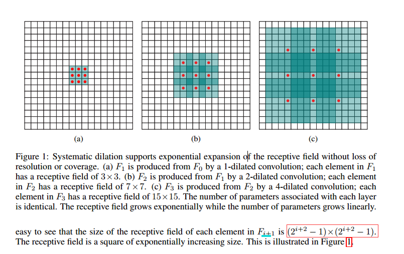

### MULTI-SCALE CONTEXT AGGREGATION BY DILATED CONVOLUTIONS



### ABSTRACT
* dense prediction problems such as semantic segmentation are structurally different from image classification. 
    * 密集预测分类和分割任务结构不一样
* we develop a new convolutional network module that is specifically designed for dense prediction
    * 我们开发新的卷积网络模型为密集预测
* uses dilated convolutions to aggregate multiscale contextual information without losing resolution. 
    * 使用空洞卷积在不损失分辨率情况下聚合多层次上下文信息
* dilated convolutions support exponential expansion of the receptive field without loss of resolution or coverage. 
    * 空洞卷积支持不损失分辨率情况下感受野指数级增长
    

### Introduction
*  Semantic segmentation is challenging because it requires combining pixel-level accuracy with multi-scale contextual 
reasoning
    * 语义分割挑战在于需要融合像素级准确度和多层上下文信息
* Modern image classification networks integrate multi-scale contextual information via successive pooling and
 subsampling layers that reduce resolution until a global prediction is obtained
    * 分类任务通过池化和下采样来减小分辨率指导获得全局预测信息
* dense prediction calls for multiscale contextual reasoning in combination with full-resolution output. 
    * 密集预测通过融合多层上下文信息获得全部分辨率输出。
* 最近的网络通过两种方式解决这两者之间的冲突
    * 第一种： 通过上采样恢复损失的分辨率， 
        * This leaves open the question of whether severe intermediate downsampling was truly necessary.
    * 第二种： 通过融合多尺度输入并获得多个尺度的输出，
        * it is not clear whether separate analysis of rescaled input images is truly necessary.
* we develop a convolutional network module that aggregates multi-scale contextual information
 without losing resolution or analyzing rescaled images.
    * 我们开发一个不损失分辨率或者改变图片尺寸的情况下聚集多尺度上下文信息的卷积网络
* The module can be plugged into existing architectures at any resolution. 
    * 该模型可以插入到已经存在的任何分辨率下任何框架下。


### Dilated Convolution



### 多尺度上下文聚合（感受野的多尺度）
* The context module is designed to increase the performance of dense prediction architectures by 
aggregating multi-scale contextual information.
    * 上下文呢模型设计增加密集预测框架的表现， 通过聚合多尺度上下文信息
* The module takes C feature maps as input and produces C feature maps as output.
    * 模型输入C个特征图输出C个特征图
* The input and output have the same form, thus the module can be plugged into existing dense prediction architectures.
    * 输入输出形式相同， 所以可以插入到任何已经存在的密集预测框架中。
* 该模块通过传递特征图到多层来暴露出上下文特征可以增加特征图的准确性，
* 7层3x3的卷积， 不同的空洞因子
    * 1, 1, 2, 4, 8, 16
* [context module](context_module.png)
* 采用训练好的模型，采用随机初始化不是有效的。
    

### Front End
* 采用VGG-16， 去掉最后两层池化和下采样
* 替换因子为2的空洞卷积
* 最后一个池化层为因子为4的空洞层，这样可以使用与训练好的分类网络参数，而产生更高分辨率的输出
* 移除了中间特征图的padding操作
    * 中间特征图padding用于原始分类网络，
    * 对于密集预测，不需要
* training
    * SGD
    * batch_size = 14
    * learning rate = 10e-3
    * momentum = 0.9
    * epoch = 60K


### Experiments
* training front-end module
    * Microsoft COCO和VOC 2012
* two steps:
    1. trained VOC_2012和Microsoft COCO
        * SGD, batch_size = 14, momentum=0.9, 
            * iterations=100K, learning_rate=10e-3,
            * iterations= 40K, learnging_rate=10e-4
    2. fine-tuned网络在VOC-2012上，
        * iterations=50K
        * learning_rate=10e-5
    

### Conclusion